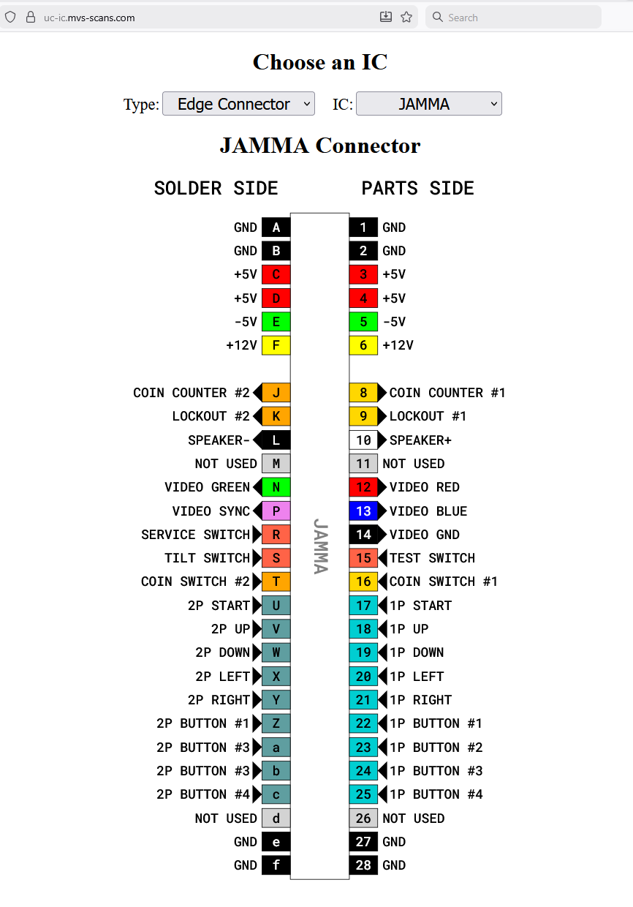
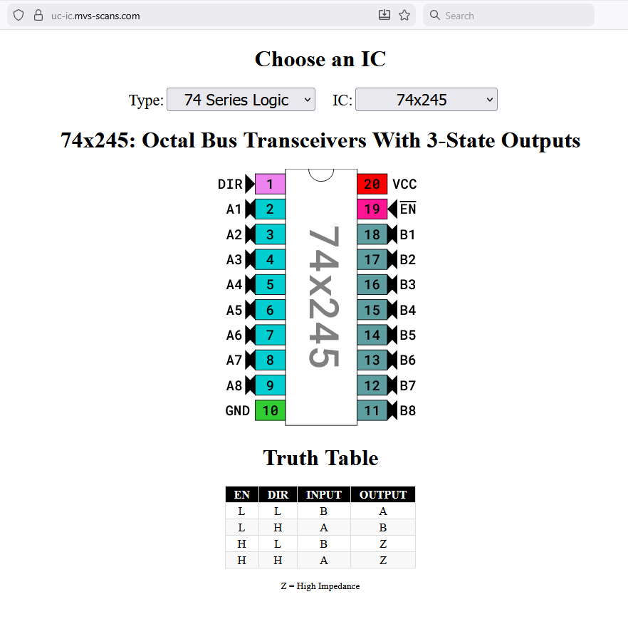
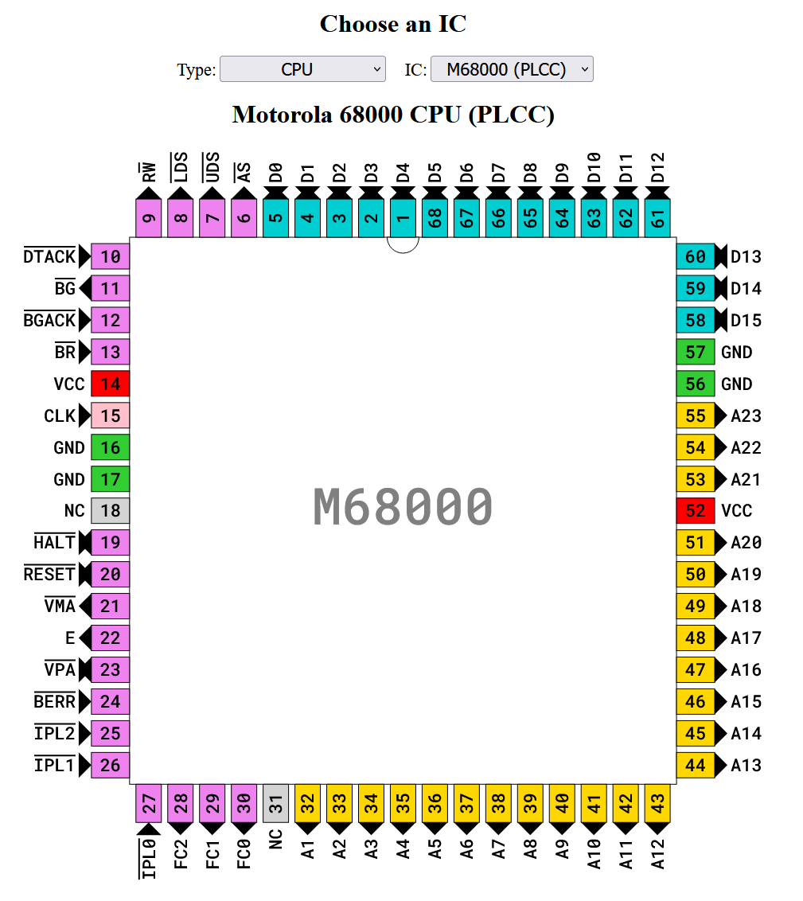

# UC IC Pinouts
The main goal of this project is to provide a quick and easy way to lookup
different IC pinouts.  As someone that repairs arcade boards often I was finding
it a bit annoying to have to google for them or fire up a pdf reader and look at
a badly scanned datasheet.

There is a copy of this project running at

https://uc-ic.mvs-scans.com

But you are encouraged to just run a copy on your local webserver.

**Examples:** 

I had a few requirements for this project
  * No server side code
    * You should be able to copy the repo to a webserver and be good to go
  * Everything is hosted on the webserver (no external dependencies)
  * ICs should just be config files that get rendered (svg)
  * Easy way (markdown) to add details about an IC (ie Truth Tables for 74 series
    logic)
  * Consistent color schemes for pin types
